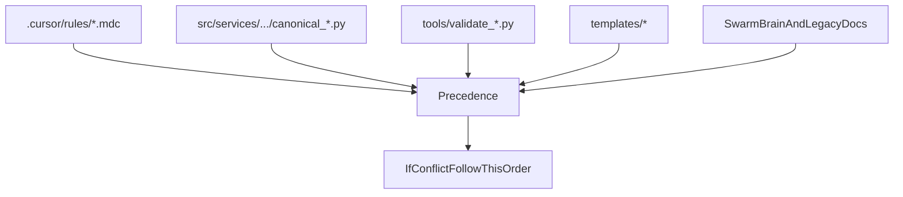

# Governance stabilization (LAW vs MEMORY)

## Goals

- Define **canonical boundaries** so only LAW can create enforceable requirements.
- Make **Swarm Brain explicitly non-canonical** (advisory only) and prevent new “requirements” from landing there.
- **Deprecate + archive** the existing “Code of Conduct” content (currently embedded in rules/templates) into `docs/legacy/`.
- Migrate enforceable governance into **dedicated MDC law files** and refactor existing MDCs to remove mixed rationale and resolve merge-conflict artifacts.

## Execution order (no commits until the end; single commit as requested)

### 1) Governance map (FIRST)

- Create [`docs/governance/GOVERNANCE_MAP.md`](docs/governance/GOVERNANCE_MAP.md) exactly per your provided copy, and ensure it references the **actual** repo artifacts:
- `.cursor/rules/*.mdc`
- [`src/services/onboarding/soft/canonical_closure_prompt.py`](src/services/onboarding/soft/canonical_closure_prompt.py)
- [`tools/validate_closure_format.py`](tools/validate_closure_format.py)
- [`templates/session-closure-template.md`](templates/session-closure-template.md)
- Add a short pointer to this map from [`.cursor/rules/README.md`](.cursor/rules/README.md) so rule readers see precedence.

### 2) Swarm Brain downgrade policy (SECOND)

- Create [`docs/governance/SWARM_BRAIN_POLICY.md`](docs/governance/SWARM_BRAIN_POLICY.md) exactly per your provided copy.
- Update Swarm Brain entry pathways so the **mandatory NON-CANONICAL header** is hard to miss:
- Add a small shared helper (or constants) to define the disclaimer header.
- Update [`mcp_servers/swarm_brain_server.py`](mcp_servers/swarm_brain_server.py) to **prepend the disclaimer** when `share_learning(..., content=...)` is missing it (covers all callers).
- Update `tools/update_swarm_brain_agent*.py` to validate/prefix as well (belt-and-suspenders; keeps behavior consistent even if MCP server is bypassed).
- Downgrade “Swarm Brain is mandatory” language in prompts/templates that drive behavior:
- Update [`src/core/messaging_template_texts.py`](src/core/messaging_template_texts.py) to remove **MANDATORY** Swarm Brain requirements and replace with advisory language + link to governance map/policy.

### 3) Code of Conduct deprecation + archive (THIRD)

- Create [`docs/legacy/code-of-conduct.md`](docs/legacy/code-of-conduct.md).
- Add the **DEPRECATED banner** exactly as provided.
- Move the existing “code of conduct” content currently embedded in [`.cursor/rules/swarm-protocol.mdc`](.cursor/rules/swarm-protocol.mdc) (the `## 📣 AGENT MESSAGING CODE OF CONDUCT` section) into this legacy doc so it’s truly “archived”.
- Update references that currently say “Swarm Code of Conduct” (notably [`src/core/messaging_template_texts.py`](src/core/messaging_template_texts.py)) to point at the deprecated doc and/or governance map.

### 4) MDC migration + refactors (AFTER the above)

#### Add dedicated LAW MDC files

- Add [`.cursor/rules/messaging-contracts.mdc`](.cursor/rules/messaging-contracts.mdc) (your provided copy), scoped to:
- `src/services/messaging/**`
- `agent_workspaces/**/inbox/**`
- Add [`.cursor/rules/git-hygiene.mdc`](.cursor/rules/git-hygiene.mdc) (your provided copy), `alwaysApply: true`.
- Replace/upgrade [`.cursor/rules/session-closure.mdc`](.cursor/rules/session-closure.mdc) to the **A+++** version you provided, and align the other closure artifacts:
- Update [`templates/session-closure-template.md`](templates/session-closure-template.md) to include the new required fields (Git Commit, Git Push, Website Blogging).
- Update [`tools/validate_closure_format.py`](tools/validate_closure_format.py) to validate those new required fields (and keep the “no next steps / no speculation / single-line public build signal” checks).
- Update [`src/services/onboarding/soft/canonical_closure_prompt.py`](src/services/onboarding/soft/canonical_closure_prompt.py) output contract to match A+++ fields so prompts, validator, template, and MDC are consistent.

#### Refactor existing MDCs to remove mixed content

- Refactor [`.cursor/rules/swarm-protocol.mdc`](.cursor/rules/swarm-protocol.mdc):
- Remove the embedded “code of conduct” block.
- Keep only structure/process; add pointers to `messaging-contracts.mdc` for enforceable messaging requirements.
- Refactor [`.cursor/rules/workflow.mdc`](.cursor/rules/workflow.mdc):
- Remove detailed git rules; keep a short pointer to `git-hygiene.mdc`.
- Refactor [`.cursor/rules/messaging.mdc`](.cursor/rules/messaging.mdc):
- Strip “limitations / enhancements / rationale” blocks that read like plans.
- Keep enforceable contract statements and pointers to scoped rules (`messaging/cli-flags.mdc`, `messaging/pyautogui-operations.mdc`) plus the new `messaging-contracts.mdc`.

#### Resolve merge-conflict markers in LAW

- Remove `<<<<<<<`, `=======`, `>>>>>>>` artifacts from these files (they’re currently present):
- [`.cursor/rules/workflow.mdc`](.cursor/rules/workflow.mdc)
- [`.cursor/rules/documentation.mdc`](.cursor/rules/documentation.mdc)
- [`.cursor/rules/agent-workspaces.mdc`](.cursor/rules/agent-workspaces.mdc)
- [`.cursor/rules/architecture.mdc`](.cursor/rules/architecture.mdc)
- [`.cursor/rules/code-style.mdc`](.cursor/rules/code-style.mdc)
- [`.cursor/rules/messaging/cli-flags.mdc`](.cursor/rules/messaging/cli-flags.mdc)
- [`.cursor/rules/messaging/pyautogui-operations.mdc`](.cursor/rules/messaging/pyautogui-operations.mdc)

## Governance precedence diagram (for docs)

