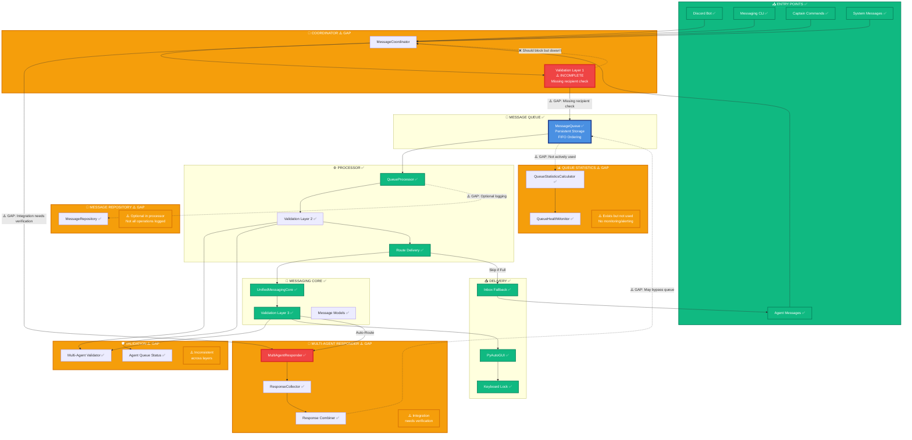
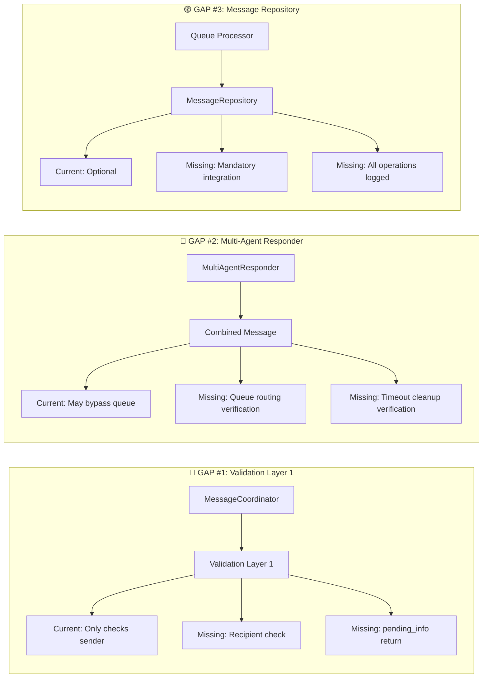
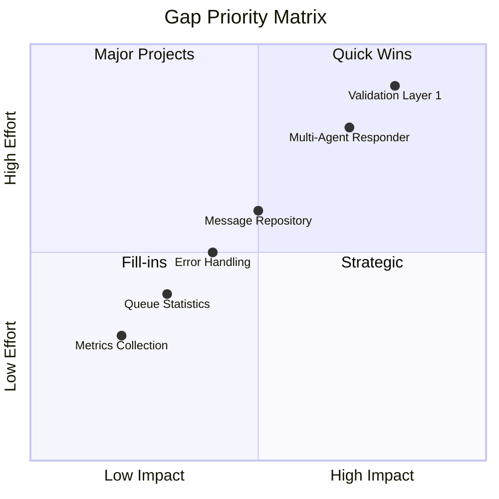
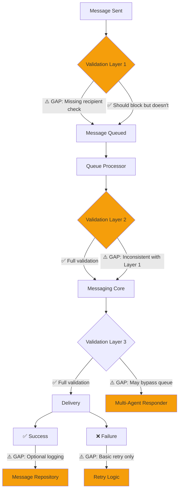
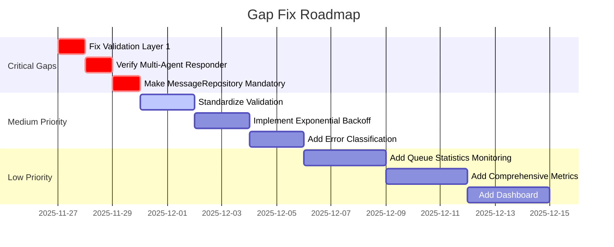

# Messaging Queue - Visual Gap Analysis

**Date**: 2025-11-27  
**Author**: Agent-4 (Captain)  
**Purpose**: Visual representation of gaps in messaging queue architecture

---

## 🎯 Gap Visualization - Architecture with Gaps Highlighted

---

## 🔴 Critical Gaps - Detailed View

---

## 📊 Gap Priority Matrix

---

## 🔄 Gap Impact Flow

---

## 🎯 Gap Fix Roadmap

---

## 📋 Gap Summary Table

| Gap ID | Component | Priority | Impact | Effort | Status |
|--------|-----------|----------|--------|--------|--------|
| **GAP-001** | Validation Layer 1 | 🔴 HIGH | High | Low | ⚠️ Identified |
| **GAP-002** | Multi-Agent Responder | 🔴 HIGH | High | Medium | ⚠️ Identified |
| **GAP-003** | Message Repository | 🟡 MEDIUM | Medium | Low | ⚠️ Identified |
| **GAP-004** | Validation Consistency | 🟡 MEDIUM | Medium | Medium | ⚠️ Identified |
| **GAP-005** | Error Handling | 🟡 MEDIUM | Medium | High | ⚠️ Identified |
| **GAP-006** | Queue Statistics | 🟢 LOW | Low | Medium | ⚠️ Identified |
| **GAP-007** | Metrics Collection | 🟢 LOW | Low | High | ⚠️ Identified |

---

## 🔍 Gap Verification Checklist

### **Critical Gaps**
- [ ] **GAP-001**: Validation Layer 1 checks recipient pending requests
- [ ] **GAP-001**: Validation Layer 1 returns 3-tuple (can_send, error, pending_info)
- [ ] **GAP-002**: Multi-Agent Responder combined messages route through queue
- [ ] **GAP-002**: Timeout cleanup verified and running
- [ ] **GAP-003**: MessageRepository mandatory in queue processor

### **Medium Priority Gaps**
- [ ] **GAP-004**: All validation layers use same logic
- [ ] **GAP-004**: Error messages standardized
- [ ] **GAP-005**: Exponential backoff implemented
- [ ] **GAP-005**: Error classification working

### **Low Priority Gaps**
- [ ] **GAP-006**: Queue statistics collected automatically
- [ ] **GAP-006**: Health monitoring running
- [ ] **GAP-007**: Comprehensive metrics collected

---

**Status**: ✅ **VISUAL GAP ANALYSIS COMPLETE**

All gaps visualized and ready for fixing! 🚀

