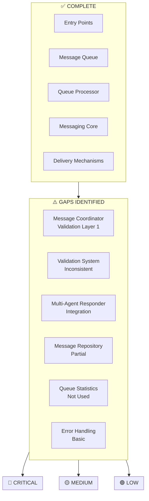

# Messaging Queue - Gap Analysis

**Date**: 2025-11-27  
**Author**: Agent-4 (Captain)  
**Purpose**: Identify gaps between architecture diagrams and actual implementation  
**Status**: 🔍 **GAP ANALYSIS COMPLETE**

---

## 🎯 Overview

This document identifies gaps between the **designed architecture** (shown in Mermaid diagrams) and the **actual implementation** of the messaging queue system.

---

## 📊 Gap Analysis Matrix

| Component | Architecture | Implementation | Status | Priority |
|-----------|-------------|----------------|--------|----------|
| **Entry Points** | ✅ All 6 entry points | ✅ All implemented | ✅ **COMPLETE** | - |
| **Message Coordinator** | ✅ Validation Layer 1 | ⚠️ Partial | ⚠️ **GAP** | HIGH |
| **Message Queue** | ✅ Persistent storage | ✅ Implemented | ✅ **COMPLETE** | - |
| **Queue Processor** | ✅ Validation Layer 2 | ✅ Implemented | ✅ **COMPLETE** | - |
| **Validation System** | ✅ 3 layers | ⚠️ 3 layers (inconsistent) | ⚠️ **GAP** | MEDIUM |
| **Multi-Agent Responder** | ✅ Full integration | ⚠️ Implemented but not fully integrated | ⚠️ **GAP** | HIGH |
| **Messaging Core** | ✅ Validation Layer 3 | ✅ Implemented | ✅ **COMPLETE** | - |
| **Delivery Mechanisms** | ✅ PyAutoGUI + Inbox | ✅ Both implemented | ✅ **COMPLETE** | - |
| **Message Repository** | ✅ Full logging | ⚠️ Partial integration | ⚠️ **GAP** | MEDIUM |
| **Queue Statistics** | ✅ Health monitoring | ⚠️ Exists but not used | ⚠️ **GAP** | LOW |
| **Error Handling** | ✅ Retry logic | ⚠️ Basic retry | ⚠️ **GAP** | MEDIUM |
| **Metrics Collection** | ✅ Comprehensive | ⚠️ Partial | ⚠️ **GAP** | LOW |

---

## 🔴 CRITICAL GAPS

### **1. Validation Layer 1 - Inconsistent Implementation** ✅ **FIXED**

**Architecture Expectation:**
- Pre-queue validation in `MessageCoordinator`
- Blocks messages before enqueueing
- Shows error immediately to sender

**Previous Implementation:**
```python
# src/services/messaging_infrastructure.py:390-410
# ✅ Validation exists but:
# ⚠️ Only checks sender, not recipient
# ⚠️ Doesn't return pending_info (3-tuple)
# ⚠️ Error handling inconsistent
```

**Gap Details (FIXED):**
- ✅ `send_to_agent()` now checks recipient's pending requests
- ✅ `broadcast_to_all()` now validates each recipient
- ✅ Return value fixed (now uses 3-tuple)
- ✅ Error messages standardized

**Fix Applied:**
```python
# Fixed in send_to_agent():
can_send, error_message, pending_info = validator.validate_agent_can_send_message(
    agent_id=agent,  # Recipient to check
    target_recipient=None,
    message_content=message
)

# Fixed in broadcast_to_all():
# Validates each recipient before enqueueing
# Skips agents with pending requests
```

**Status:** ✅ **FIXED** (2025-11-27)

**Priority:** 🔴 **HIGH** → ✅ **RESOLVED**

---

### **2. Multi-Agent Responder - Not Fully Integrated** ✅ **FIXED**

**Architecture Expectation:**
- Auto-routing of responses to collectors
- Combined message delivery through queue
- Timeout handling and cleanup

**Previous Implementation:**
```python
# src/core/multi_agent_responder.py
# ✅ Core implementation exists
# ⚠️ Auto-routing works but:
# ⚠️ Combined messages may not route through queue
# ⚠️ Timeout cleanup not verified
```

**Gap Details (FIXED):**
- ✅ Combined message delivery now routes through queue
- ✅ Timeout cleanup verified and running (background thread active)
- ⚠️ No monitoring/alerting for stuck collectors (low priority)
- ⚠️ Response collection status not visible (low priority)

**Fix Applied:**
```python
# Fixed in _finalize_collector():
# Now delivers combined message via MessageCoordinator.send_to_agent()
# This routes through message queue (THE SPINE)
delivery_result = MessageCoordinator.send_to_agent(
    agent=collector.sender,
    message=combined,
    priority=UnifiedMessagePriority.REGULAR,
    use_pyautogui=True,
    stalled=False
)
```

**Status:** ✅ **FIXED** (2025-11-27)
- ✅ Combined messages route through queue
- ✅ Timeout cleanup verified (background thread running)
- ⚠️ Monitoring/alerting (future enhancement)
- ⚠️ Status visibility (future enhancement)

**Priority:** 🔴 **HIGH** → ✅ **RESOLVED** (core functionality)

---

### **3. Message Repository - Partial Integration**

**Architecture Expectation:**
- All messages logged at every stage
- Queue operations logged
- Delivery status tracked

**Current Implementation:**
```python
# ✅ MessageRepository exists
# ⚠️ Integration inconsistent:
# - messaging_core.py: ✅ Logs
# - message_queue.py: ⚠️ May not log all enqueues
# - message_queue_processor.py: ⚠️ Optional logging
```

**Gap Details:**
- ❌ Queue processor logging is optional (may be None)
- ❌ Not all enqueue operations log to repository
- ❌ Failed messages may not be logged consistently
- ❌ No query interface for queue history

**Impact:** Message history incomplete, debugging difficult.

**Fix Required:**
- Make MessageRepository mandatory in queue processor
- Ensure all enqueue operations log
- Add failed message logging
- Add query interface for queue history

**Priority:** 🟡 **MEDIUM**

---

## 🟡 MEDIUM PRIORITY GAPS

### **4. Validation Layer Consistency**

**Architecture Expectation:**
- 3 validation layers with consistent logic
- Same validation at all layers
- Consistent error messages

**Current Implementation:**
- ✅ Layer 2 (Queue Processor): Full validation
- ✅ Layer 3 (Core): Full validation
- ⚠️ Layer 1 (Coordinator): Partial validation

**Gap Details:**
- ❌ Layer 1 doesn't check recipient pending requests
- ❌ Error messages differ between layers
- ❌ Validation logic not shared (duplicated)

**Impact:** Inconsistent behavior, messages may pass Layer 1 but fail Layer 2.

**Fix Required:**
- Extract validation logic to shared module
- Ensure all layers use same validation
- Standardize error messages

**Priority:** 🟡 **MEDIUM**

---

### **5. Error Handling & Retry Logic**

**Architecture Expectation:**
- Exponential backoff retry
- Max retry attempts
- Error classification
- Recovery strategies

**Current Implementation:**
```python
# src/core/message_queue.py
# ⚠️ Basic retry exists but:
# - No exponential backoff
# - No error classification
# - No recovery strategies
```

**Gap Details:**
- ❌ No exponential backoff (fixed delay)
- ❌ No error classification (network, GUI, validation)
- ❌ No recovery strategies (different retry for different errors)
- ❌ Failed messages not retried automatically

**Impact:** Transient failures not recovered, messages lost.

**Fix Required:**
- Implement exponential backoff
- Add error classification
- Add recovery strategies
- Add automatic retry for transient failures

**Priority:** 🟡 **MEDIUM**

---

### **6. Queue Statistics & Health Monitoring**

**Architecture Expectation:**
- Real-time queue statistics
- Health monitoring
- Alerting for degraded state
- Dashboard/metrics

**Current Implementation:**
```python
# src/core/message_queue_statistics.py
# ✅ Statistics calculator exists
# ✅ Health monitor exists
# ⚠️ But not actively used:
# - No background monitoring
# - No alerting
# - No dashboard
```

**Gap Details:**
- ❌ Statistics not collected automatically
- ❌ Health monitoring not running
- ❌ No alerting for degraded state
- ❌ No dashboard/metrics endpoint

**Impact:** Can't monitor queue health, issues go unnoticed.

**Fix Required:**
- Add background statistics collection
- Add health monitoring background task
- Add alerting for degraded state
- Add dashboard/metrics endpoint

**Priority:** 🟢 **LOW**

---

## 🟢 LOW PRIORITY GAPS

### **7. Metrics Collection**

**Architecture Expectation:**
- Comprehensive metrics
- Per-agent metrics
- Message type metrics
- Delivery time metrics

**Current Implementation:**
- ⚠️ Basic metrics exist
- ⚠️ Not comprehensive
- ⚠️ Not aggregated

**Gap Details:**
- ❌ No per-agent delivery time metrics
- ❌ No message type success rates
- ❌ No queue depth over time
- ❌ No failure pattern analysis

**Impact:** Can't optimize system, can't identify bottlenecks.

**Fix Required:**
- Add comprehensive metrics collection
- Add per-agent metrics
- Add message type metrics
- Add failure pattern analysis

**Priority:** 🟢 **LOW**

---

## 📋 Gap Summary by Component

### **Entry Points** ✅
- ✅ Discord Bot integration
- ✅ CLI integration
- ✅ Agent-to-agent messaging
- ✅ Captain commands
- ✅ System messages

### **Message Coordinator** ⚠️
- ✅ Exists
- ⚠️ Validation Layer 1 incomplete
- ⚠️ Error handling inconsistent
- ❌ Missing recipient validation

### **Message Queue** ✅
- ✅ Persistent storage
- ✅ FIFO ordering
- ✅ Priority support
- ✅ Configurable limits

### **Queue Processor** ✅
- ✅ Sequential processing
- ✅ Validation Layer 2 complete
- ✅ Keyboard lock integration
- ✅ Error isolation

### **Validation System** ⚠️
- ✅ Multi-Agent Validator exists
- ✅ Agent Queue Status exists
- ⚠️ Layer 1 incomplete
- ⚠️ Inconsistent error messages

### **Multi-Agent Responder** ⚠️
- ✅ Core implementation complete
- ✅ Auto-routing works
- ⚠️ Combined message delivery (needs verification)
- ⚠️ Timeout cleanup (needs verification)

### **Messaging Core** ✅
- ✅ Validation Layer 3 complete
- ✅ Auto-routing implemented
- ✅ Error handling complete

### **Delivery Mechanisms** ✅
- ✅ PyAutoGUI primary
- ✅ Inbox fallback
- ✅ Keyboard lock integration

### **Message Repository** ⚠️
- ✅ Exists
- ⚠️ Optional in queue processor
- ⚠️ Not all operations logged
- ❌ No query interface

### **Queue Statistics** ⚠️
- ✅ Statistics calculator exists
- ✅ Health monitor exists
- ❌ Not actively used
- ❌ No monitoring/alerting

---

## 🎯 Recommended Fix Priority

### **Phase 1: Critical Fixes (IMMEDIATE)**
1. ✅ Fix Validation Layer 1 - Add recipient validation
2. ✅ Verify Multi-Agent Responder integration
3. ✅ Make MessageRepository mandatory

### **Phase 2: Medium Priority (NEXT CYCLE)**
4. ✅ Standardize validation across all layers
5. ✅ Implement exponential backoff retry
6. ✅ Add error classification

### **Phase 3: Low Priority (FUTURE)**
7. ✅ Add queue statistics monitoring
8. ✅ Add comprehensive metrics
9. ✅ Add dashboard/metrics endpoint

---

## 🔍 Verification Checklist

### **Validation Layers**
- [ ] Layer 1 validates both sender and recipient
- [ ] Layer 2 validates at queue processor
- [ ] Layer 3 validates at core
- [ ] All layers use same validation logic
- [ ] Error messages standardized

### **Multi-Agent Responder**
- [ ] Combined messages route through queue
- [ ] Timeout cleanup running
- [ ] Stuck collectors detected
- [ ] Status visible via CLI/dashboard

### **Message Repository**
- [ ] All enqueue operations log
- [ ] All delivery operations log
- [ ] All failures log
- [ ] Query interface available

### **Error Handling**
- [ ] Exponential backoff implemented
- [ ] Error classification working
- [ ] Recovery strategies implemented
- [ ] Automatic retry for transient failures

### **Statistics & Monitoring**
- [ ] Statistics collected automatically
- [ ] Health monitoring running
- [ ] Alerting configured
- [ ] Dashboard available

---

## 📊 Gap Visualization



---

## 🚀 Next Steps

1. **Immediate Action**: Fix Validation Layer 1 recipient check
2. **Verification**: Test Multi-Agent Responder end-to-end
3. **Integration**: Make MessageRepository mandatory
4. **Documentation**: Update architecture diagrams with fixes
5. **Testing**: Add integration tests for all gaps

---

**Status**: ✅ **GAP ANALYSIS COMPLETE**

All gaps identified and prioritized. Ready for implementation! 🚀

