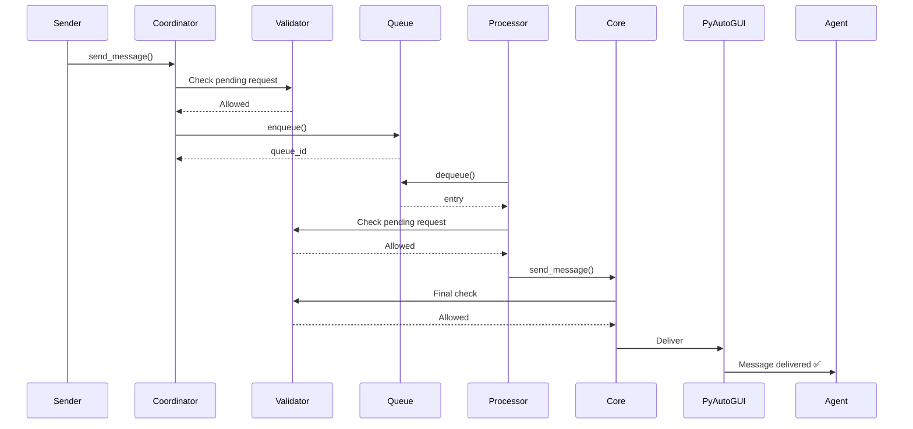
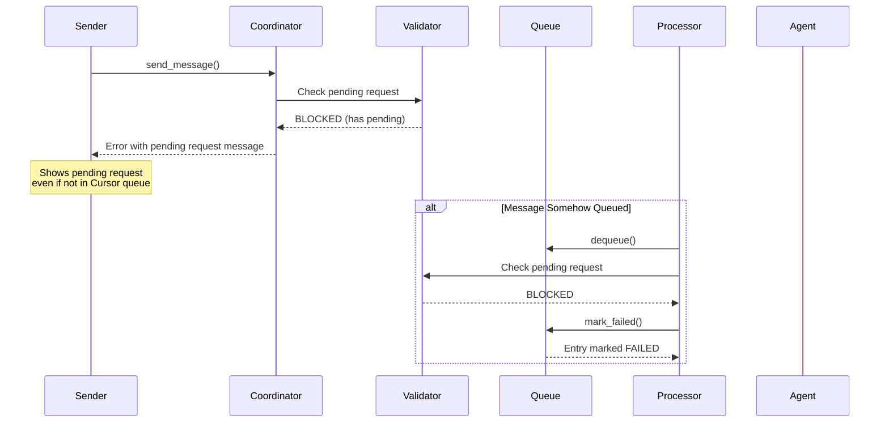
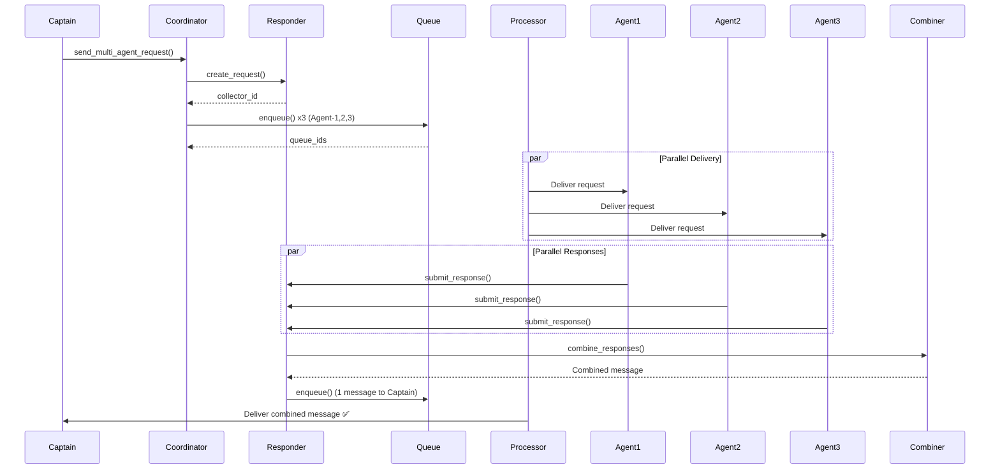
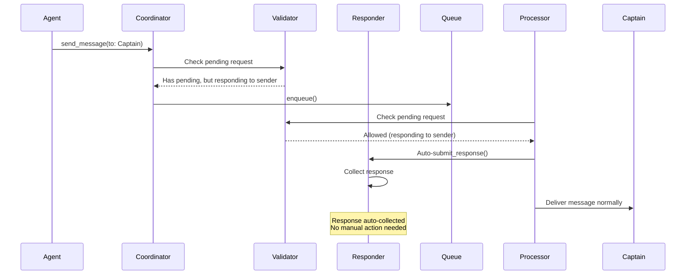

# Messaging Queue - The Spine of the System

**Date**: 2025-11-27  
**Author**: Agent-4 (Captain)  
**Status**: 🎯 **System Architecture Visualization**

---

## 🎯 Overview

The **Message Queue** is the **SPINE** of the Agent Cellphone V2 system. All messaging flows through it, connecting every component of the swarm architecture.

---

## 🏗️ Complete System Architecture

### **The Spine - Central Nervous System**

```mermaid
graph TB
    %% ============================================
    %% ENTRY POINTS - All Message Sources
    %% ============================================
    subgraph EntryPoints["📥 MESSAGE ENTRY POINTS"]
        Discord[Discord Bot<br/>unified_discord_bot.py]
        CLI[Messaging CLI<br/>messaging_cli.py]
        Agents[Agent-to-Agent<br/>Direct Messaging]
        Captain[Captain Commands<br/>Agent-4]
        System[System Messages<br/>Automated]
        Human[Human Input<br/>Manual]
    end

    %% ============================================
    %% MESSAGE COORDINATOR - Entry Layer
    %% ============================================
    subgraph Coordinator["🎯 MESSAGE COORDINATOR"]
        MessageCoord[MessageCoordinator<br/>send_to_agent<br/>broadcast_to_all<br/>send_multi_agent_request]
        Validation1[Validation Layer 1<br/>Pre-Queue Check]
    end

    %% ============================================
    %% MESSAGE QUEUE - THE SPINE
    %% ============================================
    subgraph Queue["🔄 MESSAGE QUEUE - THE SPINE"]
        QueueStorage[MessageQueue<br/>Persistent Storage<br/>FIFO Ordering]
        QueueConfig[QueueConfig<br/>Max Size: 1000<br/>Batch Size: 10<br/>Timeout: 7 days]
    end

    %% ============================================
    %% QUEUE PROCESSOR - Delivery Engine
    %% ============================================
    subgraph Processor["⚙️ QUEUE PROCESSOR"]
        QueueProc[MessageQueueProcessor<br/>Sequential Processing<br/>Keyboard Lock]
        Validation2[Validation Layer 2<br/>At Delivery Check]
        RouteDelivery[Route Delivery<br/>PyAutoGUI or Inbox]
    end

    %% ============================================
    %% VALIDATION SYSTEM
    %% ============================================
    subgraph Validation["🛡️ VALIDATION SYSTEM"]
        Validator[Multi-Agent Validator<br/>Check Pending Requests]
        QueueStatus[Agent Queue Status<br/>Cursor Queue Full Detection]
    end

    %% ============================================
    %% MULTI-AGENT RESPONDER
    %% ============================================
    subgraph MultiAgent["🐝 MULTI-AGENT RESPONDER"]
        Responder[MultiAgentResponder<br/>Response Collection]
        Collector[ResponseCollector<br/>Collect Responses]
        Combiner[Response Combiner<br/>Merge into 1 Message]
    end

    %% ============================================
    %% DELIVERY MECHANISMS
    %% ============================================
    subgraph Delivery["📤 DELIVERY MECHANISMS"]
        PyAutoGUI[PyAutoGUI Delivery<br/>PRIMARY<br/>Keyboard Control Lock]
        InboxFallback[Inbox Fallback<br/>BACKUP<br/>File Creation]
    end

    %% ============================================
    %% MESSAGING CORE
    %% ============================================
    subgraph Core["💎 MESSAGING CORE"]
        MessagingCore[UnifiedMessagingCore<br/>send_message<br/>send_message_object]
        Validation3[Validation Layer 3<br/>Core Level Check]
        MessageModels[Message Models<br/>UnifiedMessage<br/>Message Types]
    end

    %% ============================================
    %% AGENT WORKSPACES
    %% ============================================
    subgraph Agents["🤖 AGENT WORKSPACES"]
        Agent1[Agent-1<br/>Integration & Core]
        Agent2[Agent-2<br/>Architecture]
        Agent3[Agent-3<br/>Infrastructure]
        Agent4[Agent-4<br/>Captain]
        Agent5[Agent-5<br/>Business Intelligence]
        Agent6[Agent-6<br/>Coordination]
        Agent7[Agent-7<br/>Web Development]
        Agent8[Agent-8<br/>SSOT & Integration]
    end

    %% ============================================
    %% SUPPORTING SYSTEMS
    %% ============================================
    subgraph Support["🔧 SUPPORTING SYSTEMS"]
        KeyboardLock[Keyboard Control Lock<br/>Global Synchronization]
        CoordinateLoader[Coordinate Loader<br/>Agent Positions]
        StatusReader[Status Reader<br/>Agent Status.json]
        InboxUtility[Inbox Utility<br/>File Creation]
        MessageRepo[Message Repository<br/>History & Logging]
    end

    %% ============================================
    %% CONNECTIONS - ENTRY POINTS TO COORDINATOR
    %% ============================================
    Discord --> MessageCoord
    CLI --> MessageCoord
    Agents --> MessageCoord
    Captain --> MessageCoord
    System --> MessageCoord
    Human --> MessageCoord

    %% ============================================
    %% COORDINATOR TO VALIDATION TO QUEUE
    %% ============================================
    MessageCoord --> Validation1
    Validation1 -->|"Pass"| QueueStorage
    Validation1 -->|"Block"| Validator
    Validator -.->|"Show Error"| EntryPoints

    %% ============================================
    %% QUEUE TO PROCESSOR
    %% ============================================
    QueueStorage --> QueueProc
    QueueConfig --> QueueStorage

    %% ============================================
    %% PROCESSOR VALIDATION AND ROUTING
    %% ============================================
    QueueProc --> Validation2
    Validation2 --> Validator
    Validation2 --> QueueStatus
    Validation2 -->|"Pass"| RouteDelivery
    Validation2 -->|"Block"| QueueStorage
    QueueStorage -.->|"Mark FAILED"| QueueStorage

    %% ============================================
    %% ROUTE DELIVERY TO CORE
    %% ============================================
    RouteDelivery --> MessagingCore
    RouteDelivery -->|"Skip if Full"| InboxFallback

    %% ============================================
    %% CORE VALIDATION AND DELIVERY
    %% ============================================
    MessagingCore --> Validation3
    Validation3 --> Validator
    Validation3 -->|"Pass"| PyAutoGUI
    Validation3 -->|"Block"| MessagingCore
    Validation3 -->|"Auto-Route"| Responder

    %% ============================================
    %% MULTI-AGENT RESPONDER FLOW
    %% ============================================
    MessageCoord -->|"Multi-Agent Request"| Responder
    Responder --> Collector
    Collector --> Combiner
    Combiner --> QueueStorage
    Validation3 -.->|"Auto-Submit"| Collector

    %% ============================================
    %% DELIVERY TO AGENTS
    %% ============================================
    PyAutoGUI --> KeyboardLock
    KeyboardLock --> Agent1
    KeyboardLock --> Agent2
    KeyboardLock --> Agent3
    KeyboardLock --> Agent4
    KeyboardLock --> Agent5
    KeyboardLock --> Agent6
    KeyboardLock --> Agent7
    KeyboardLock --> Agent8

    InboxFallback --> InboxUtility
    InboxUtility --> Agent1
    InboxUtility --> Agent2
    InboxUtility --> Agent3
    InboxUtility --> Agent4
    InboxUtility --> Agent5
    InboxUtility --> Agent6
    InboxUtility --> Agent7
    InboxUtility --> Agent8

    %% ============================================
    %% SUPPORTING SYSTEM CONNECTIONS
    %% ============================================
    CoordinateLoader --> PyAutoGUI
    StatusReader --> Validator
    MessageRepo --> QueueProc
    QueueStatus --> RouteDelivery

    %% ============================================
    %% STYLING
    %% ============================================
    classDef queueStyle fill:#4a90e2,stroke:#2c5aa0,stroke-width:3px,color:#fff
    classDef processorStyle fill:#50c878,stroke:#2d8659,stroke-width:2px,color:#fff
    classDef validationStyle fill:#ff6b6b,stroke:#c92a2a,stroke-width:2px,color:#fff
    classDef deliveryStyle fill:#ffa500,stroke:#cc8500,stroke-width:2px,color:#fff
    classDef agentStyle fill:#9b59b6,stroke:#6c3483,stroke-width:2px,color:#fff
    classDef supportStyle fill:#95a5a6,stroke:#7f8c8d,stroke-width:2px,color:#fff

    class QueueStorage,QueueConfig queueStyle
    class QueueProc,RouteDelivery processorStyle
    class Validation1,Validation2,Validation3,Validator validationStyle
    class PyAutoGUI,InboxFallback,InboxUtility deliveryStyle
    class Agent1,Agent2,Agent3,Agent4,Agent5,Agent6,Agent7,Agent8 agentStyle
    class KeyboardLock,CoordinateLoader,StatusReader,MessageRepo,QueueStatus supportStyle
```



---

## 🔄 Message Flow Paths

### **Path 1: Normal Message Flow**



### **Path 2: Blocked Message Flow**



### **Path 3: Multi-Agent Request Flow**



### **Path 4: Auto-Route Response Flow**



---

## 🎯 Key Integration Points

### **1. Entry Points → Coordinator → Queue**

All message sources flow through MessageCoordinator:
- Discord Bot → `ConsolidatedMessagingService` → Queue
- CLI → `MessageCoordinator.send_to_agent()` → Queue
- Agents → `send_message()` → Queue
- Captain → `MessageCoordinator` → Queue

### **2. Queue → Processor → Validation**

Queue processor validates before delivery:
- Checks pending multi-agent requests
- Checks agent queue status (full/available)
- Marks blocked entries as FAILED
- Continues processing other messages

### **3. Processor → Core → Delivery**

Delivery routing:
- Primary: PyAutoGUI (with keyboard lock)
- Fallback: Inbox (when queue full or PyAutoGUI fails)
- Auto-routing: Responses to multi-agent requests

### **4. Multi-Agent Responder Integration**

- Creates collectors when requests sent
- Auto-routes responses when agents respond to sender
- Combines responses into single message
- Delivers combined message to original sender

---

## 📊 System Metrics

### **Queue Metrics**
- **Max Size**: 1000 messages
- **Batch Size**: 10 messages per batch
- **Processing**: Sequential (one at a time)
- **Timeout**: 7 days (auto-cleanup)

### **Validation Layers**
- **Layer 1**: Pre-queue (immediate feedback)
- **Layer 2**: Queue processor (defense in depth)
- **Layer 3**: Core messaging (final safety net)

### **Delivery Methods**
- **Primary**: PyAutoGUI (keyboard control)
- **Fallback**: Inbox (file creation)
- **Auto-Route**: Multi-agent responder

---

## 🔗 Dependencies

### **Queue Depends On**
- Message persistence (file-based)
- Keyboard control lock
- Coordinate loader
- Status reader

### **Queue Provides To**
- All messaging entry points
- Queue processor
- Delivery mechanisms
- Multi-agent responder
- Validation system

---

## 🎯 The Spine Concept

The Message Queue is the **SPINE** because:

1. **Central Nervous System**: All messages flow through it
2. **Coordination Hub**: Synchronizes all messaging operations
3. **Validation Gateway**: All messages validated before/at delivery
4. **Delivery Orchestrator**: Routes to appropriate delivery mechanism
5. **State Management**: Tracks message state (PENDING → DELIVERED/FAILED)
6. **Integration Point**: Connects all system components

**Without the Queue**: Messages would conflict, race conditions would occur, agents would get confused.

**With the Queue**: Sequential processing, synchronized delivery, proper validation, reliable messaging.

---

## 🚀 System Flow Summary

```
ALL ENTRY POINTS
    ↓
MESSAGE COORDINATOR (Validation Layer 1)
    ↓
MESSAGE QUEUE (THE SPINE)
    ↓
QUEUE PROCESSOR (Validation Layer 2)
    ↓
MESSAGING CORE (Validation Layer 3)
    ↓
DELIVERY (PyAutoGUI or Inbox)
    ↓
AGENTS (All 8 Agents)
```

**Multi-Agent Requests**:
```
COORDINATOR → RESPONDER → QUEUE → AGENTS → RESPONDER → COMBINER → QUEUE → SENDER
```

---

**Status**: ✅ **Complete Architecture Visualization**

The Message Queue is truly the **SPINE** of the system - everything flows through it! 🚀

