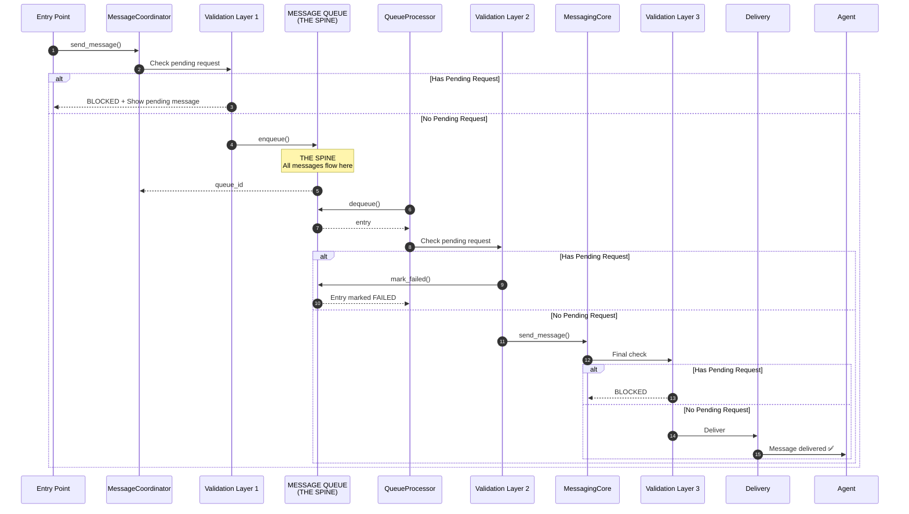
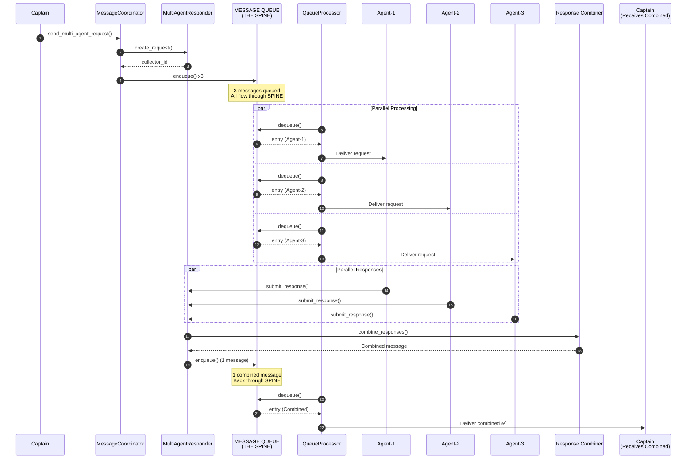
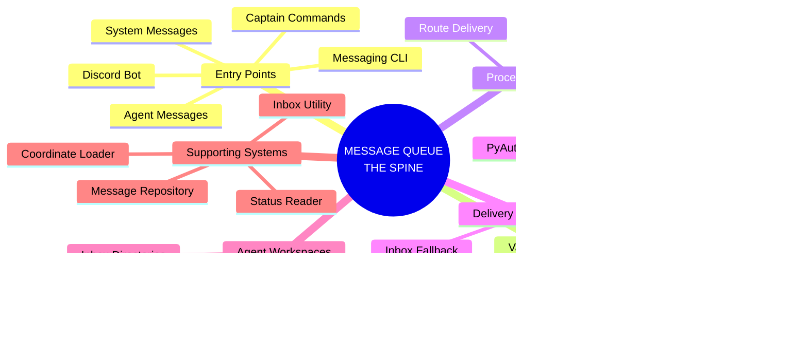
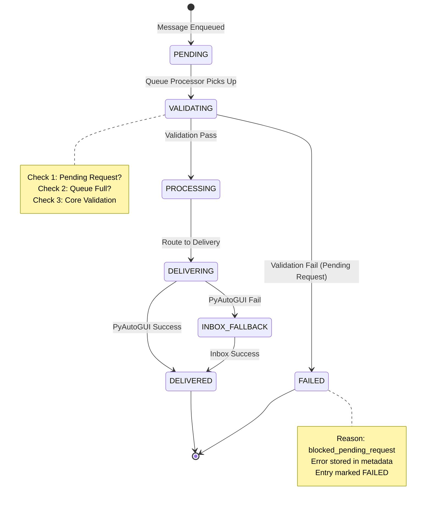
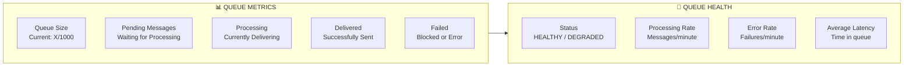

# Messaging Queue - The Spine of the System

**Date**: 2025-11-27  
**Author**: Agent-4 (Captain)  
**Visualization**: Mermaid.js Architecture Diagrams

---

## 🎯 The Spine Concept

The **Message Queue** is the **SPINE** - the central nervous system that connects every component of the Agent Cellphone V2 architecture. All messaging flows through it, ensuring synchronized, reliable, and validated communication.

---

## 🏗️ Complete System Architecture

```mermaid
graph TB
    %% ============================================
    %% ENTRY POINTS - All Message Sources
    %% ============================================
    subgraph Entry["📥 ENTRY POINTS"]
        Discord[Discord Bot]
        CLI[Messaging CLI]
        Agents[Agent Messages]
        Captain[Captain Commands]
        System[System Messages]
    end

    %% ============================================
    %% MESSAGE COORDINATOR
    %% ============================================
    subgraph Coord["🎯 COORDINATOR"]
        MC[MessageCoordinator]
        V1[Validation Layer 1]
    end

    %% ============================================
    %% MESSAGE QUEUE - THE SPINE
    %% ============================================
    subgraph Spine["🔄 MESSAGE QUEUE - THE SPINE"]
        MQ[MessageQueue<br/>Persistent Storage<br/>FIFO Ordering<br/>Max: 1000 messages]
    end

    %% ============================================
    %% QUEUE PROCESSOR
    %% ============================================
    subgraph Proc["⚙️ PROCESSOR"]
        QP[QueueProcessor<br/>Sequential Processing]
        V2[Validation Layer 2]
        RD[Route Delivery]
    end

    %% ============================================
    %% VALIDATION & STATUS
    %% ============================================
    subgraph Valid["🛡️ VALIDATION"]
        MAV[Multi-Agent Validator]
        AQS[Agent Queue Status]
    end

    %% ============================================
    %% MULTI-AGENT RESPONDER
    %% ============================================
    subgraph MAR["🐝 MULTI-AGENT RESPONDER"]
        Responder[MultiAgentResponder]
        Collector[ResponseCollector]
        Combiner[Response Combiner]
    end

    %% ============================================
    %% MESSAGING CORE
    %% ============================================
    subgraph Core["💎 MESSAGING CORE"]
        UMC[UnifiedMessagingCore]
        V3[Validation Layer 3]
        Models[Message Models]
    end

    %% ============================================
    %% DELIVERY MECHANISMS
    %% ============================================
    subgraph Deliv["📤 DELIVERY"]
        PyAuto[PyAutoGUI<br/>PRIMARY]
        Inbox[Inbox Fallback<br/>BACKUP]
        KBLock[Keyboard Lock<br/>Global Sync]
    end

    %% ============================================
    %% AGENT WORKSPACES
    %% ============================================
    subgraph Agents["🤖 AGENTS"]
        A1[Agent-1]
        A2[Agent-2]
        A3[Agent-3]
        A4[Agent-4<br/>Captain]
        A5[Agent-5]
        A6[Agent-6]
        A7[Agent-7]
        A8[Agent-8]
    end

    %% ============================================
    %% SUPPORTING SYSTEMS
    %% ============================================
    subgraph Support["🔧 SUPPORT"]
        Coords[Coordinate Loader]
        Status[Status Reader]
        Repo[Message Repository]
        InboxUtil[Inbox Utility]
    end

    %% ============================================
    %% CONNECTIONS - ENTRY TO COORDINATOR
    %% ============================================
    Discord --> MC
    CLI --> MC
    Agents --> MC
    Captain --> MC
    System --> MC

    %% ============================================
    %% COORDINATOR TO QUEUE (THE SPINE)
    %% ============================================
    MC --> V1
    V1 -->|"Pass"| MQ
    V1 -->|"Block"| MAV
    MAV -.->|"Error"| Entry

    %% ============================================
    %% QUEUE TO PROCESSOR (SPINE TO BRAIN)
    %% ============================================
    MQ -->|"Sequential"| QP
    QP --> V2
    V2 --> MAV
    V2 --> AQS
    V2 -->|"Pass"| RD
    V2 -->|"Block"| MQ
    MQ -.->|"Mark FAILED"| MQ

    %% ============================================
    %% PROCESSOR TO CORE
    %% ============================================
    RD --> UMC
    RD -->|"Skip if Full"| Inbox
    UMC --> V3
    V3 --> MAV
    V3 -->|"Pass"| PyAuto
    V3 -->|"Block"| UMC
    V3 -->|"Auto-Route"| Responder

    %% ============================================
    %% MULTI-AGENT FLOW
    %% ============================================
    MC -->|"Multi-Agent Request"| Responder
    Responder --> Collector
    Collector --> Combiner
    Combiner --> MQ
    V3 -.->|"Auto-Submit"| Collector

    %% ============================================
    %% DELIVERY TO AGENTS
    %% ============================================
    PyAuto --> KBLock
    KBLock --> A1
    KBLock --> A2
    KBLock --> A3
    KBLock --> A4
    KBLock --> A5
    KBLock --> A6
    KBLock --> A7
    KBLock --> A8

    Inbox --> InboxUtil
    InboxUtil --> A1
    InboxUtil --> A2
    InboxUtil --> A3
    InboxUtil --> A4
    InboxUtil --> A5
    InboxUtil --> A6
    InboxUtil --> A7
    InboxUtil --> A8

    %% ============================================
    %% SUPPORTING CONNECTIONS
    %% ============================================
    Coords --> PyAuto
    Status --> MAV
    Repo --> QP
    AQS --> RD

    %% ============================================
    %% STYLING - SPINE HIGHLIGHTED
    %% ============================================
    classDef spineStyle fill:#4a90e2,stroke:#1e3a8a,stroke-width:4px,color:#fff,font-weight:bold
    classDef entryStyle fill:#10b981,stroke:#047857,stroke-width:2px,color:#fff
    classDef processorStyle fill:#f59e0b,stroke:#d97706,stroke-width:2px,color:#fff
    classDef validationStyle fill:#ef4444,stroke:#dc2626,stroke-width:2px,color:#fff
    classDef deliveryStyle fill:#8b5cf6,stroke:#6d28d9,stroke-width:2px,color:#fff
    classDef agentStyle fill:#ec4899,stroke:#be185d,stroke-width:2px,color:#fff
    classDef supportStyle fill:#6b7280,stroke:#4b5563,stroke-width:2px,color:#fff

    class MQ spineStyle
    class Discord,CLI,Agents,Captain,System entryStyle
    class QP,RD processorStyle
    class V1,V2,V3,MAV,AQS validationStyle
    class PyAuto,Inbox,KBLock,InboxUtil deliveryStyle
    class A1,A2,A3,A4,A5,A6,A7,A8 agentStyle
    class Coords,Status,Repo supportStyle
```



---

## 🔄 Message Flow - The Spine in Action



---

## 🐝 Multi-Agent Request Flow Through Spine



---

## 🎯 The Spine - Integration Map



---

## 📊 Queue States Through Spine



---

## 🔗 Component Integration Matrix

| Component | Integrates With Queue | Purpose |
|-----------|----------------------|---------|
| **Discord Bot** | ✅ Yes | All Discord messages → Queue |
| **Messaging CLI** | ✅ Yes | CLI commands → Queue |
| **Agent Messages** | ✅ Yes | Agent-to-agent → Queue |
| **Captain Commands** | ✅ Yes | Captain messages → Queue |
| **Queue Processor** | ✅ Yes | Processes queue → Delivery |
| **Multi-Agent Responder** | ✅ Yes | Requests & responses → Queue |
| **Validation System** | ✅ Yes | Validates before/at delivery |
| **PyAutoGUI Delivery** | ✅ Yes | Delivers via queue processing |
| **Inbox Fallback** | ✅ Yes | Fallback via queue processing |
| **Message Repository** | ✅ Yes | Logs all queue operations |
| **Status Reader** | ✅ Yes | Checks agent status for validation |
| **Coordinate Loader** | ✅ Yes | Provides coordinates for delivery |

---

## 🎯 Why It's The Spine

### **1. Central Nervous System**
- All messages flow through it
- Coordinates all messaging operations
- Single point of control

### **2. Synchronization Hub**
- Prevents race conditions
- Sequential processing
- Keyboard lock coordination

### **3. Validation Gateway**
- 3-layer validation system
- Blocks invalid messages
- Ensures compliance

### **4. State Management**
- Tracks message lifecycle
- PENDING → PROCESSING → DELIVERED/FAILED
- Persistent storage

### **5. Integration Point**
- Connects all system components
- Entry points → Queue → Delivery
- Multi-agent responder integration

### **6. Reliability Engine**
- Retry logic
- Error handling
- Fallback mechanisms

---

## 📈 Queue Metrics & Health



---

## 🚀 System Flow Summary

```
┌─────────────────────────────────────────────────────────┐
│                    ALL ENTRY POINTS                     │
│  (Discord, CLI, Agents, Captain, System, Human)         │
└───────────────────────┬─────────────────────────────────┘
                        ↓
┌─────────────────────────────────────────────────────────┐
│              MESSAGE COORDINATOR                         │
│         (Validation Layer 1 - Pre-Queue)                  │
└───────────────────────┬─────────────────────────────────┘
                        ↓
        ┌───────────────┴───────────────┐
        │                               │
        ↓                               ↓
   BLOCKED                        ALLOWED
   (Show Error)                   (Continue)
        │                               │
        └───────────────┬───────────────┘
                        ↓
┌─────────────────────────────────────────────────────────┐
│            MESSAGE QUEUE - THE SPINE                     │
│     (Persistent Storage, FIFO, Max 1000 messages)       │
│                                                          │
│  ┌──────────┐  ┌──────────┐  ┌──────────┐            │
│  │ PENDING  │→ │PROCESSING│→ │ DELIVERED│            │
│  └──────────┘  └──────────┘  └──────────┘            │
│       │              │              │                    │
│       └──────────────┴──────────────┘                    │
│                    │                                      │
│                    ↓                                      │
│              ┌──────────┐                                │
│              │  FAILED  │                                │
│              └──────────┘                                │
└───────────────────────┬─────────────────────────────────┘
                        ↓
┌─────────────────────────────────────────────────────────┐
│              QUEUE PROCESSOR                             │
│    (Sequential Processing, Validation Layer 2)          │
└───────────────────────┬─────────────────────────────────┘
                        ↓
┌─────────────────────────────────────────────────────────┐
│              MESSAGING CORE                              │
│       (Validation Layer 3, Auto-Routing)                │
└───────────────────────┬─────────────────────────────────┘
                        ↓
        ┌───────────────┴───────────────┐
        │                               │
        ↓                               ↓
   PyAutoGUI                      Inbox Fallback
   (PRIMARY)                      (BACKUP)
        │                               │
        └───────────────┬───────────────┘
                        ↓
┌─────────────────────────────────────────────────────────┐
│                    ALL AGENTS                           │
│     (Agent-1 through Agent-8 + Captain Agent-4)          │
└─────────────────────────────────────────────────────────┘
```

---

## 🎯 Key Integration Points

### **1. Entry → Coordinator → Queue**
- All messages enter through MessageCoordinator
- Validation before enqueueing
- Immediate feedback on blocks

### **2. Queue → Processor → Validation**
- Queue processor validates at delivery
- Defense in depth strategy
- Marks blocked entries as FAILED

### **3. Processor → Core → Delivery**
- Core messaging validates again
- Auto-routes multi-agent responses
- Routes to PyAutoGUI or Inbox

### **4. Multi-Agent Responder**
- Creates collectors for requests
- Collects responses through queue
- Combines and re-queues for delivery

---

## 📊 Queue as The Spine - Visual Summary

```
                    ┌─────────────┐
                    │   ENTRY     │
                    │   POINTS    │
                    └──────┬──────┘
                           │
                    ┌──────▼──────┐
                    │ COORDINATOR │
                    │ (Validation)│
                    └──────┬──────┘
                           │
        ┌──────────────────┴──────────────────┐
        │                                      │
        ▼                                      ▼
┌───────────────┐                    ┌───────────────┐
│   BLOCKED     │                    │   ALLOWED    │
│  (Show Error) │                    │  (Continue)  │
└───────────────┘                    └──────┬───────┘
                                            │
                                    ┌───────▼────────┐
                                    │                │
                                    │  MESSAGE QUEUE │
                                    │   (THE SPINE)  │
                                    │                │
                                    │  ┌──────────┐ │
                                    │  │ PENDING │ │
                                    │  └────┬─────┘ │
                                    │       │       │
                                    │  ┌────▼─────┐ │
                                    │  │PROCESSING│ │
                                    │  └────┬─────┘ │
                                    │       │       │
                                    │  ┌────▼─────┐ │
                                    │  │DELIVERED │ │
                                    │  └──────────┘ │
                                    └───────┬───────┘
                                            │
                                    ┌───────▼───────┐
                                    │   PROCESSOR   │
                                    │  (Validation) │
                                    └───────┬───────┘
                                            │
                                    ┌───────▼───────┐
                                    │  MESSAGING    │
                                    │     CORE      │
                                    │  (Validation) │
                                    └───────┬───────┘
                                            │
                            ┌───────────────┴───────────────┐
                            │                               │
                            ▼                               ▼
                    ┌───────────────┐              ┌───────────────┐
                    │   PyAutoGUI   │              │    Inbox      │
                    │   (PRIMARY)   │              │   (BACKUP)    │
                    └───────┬───────┘              └───────┬───────┘
                            │                               │
                            └───────────────┬───────────────┘
                                            │
                                    ┌───────▼───────┐
                                    │    AGENTS     │
                                    │  (All 8 + Cap)│
                                    └───────────────┘
```

---

**Status**: ✅ **Complete Mermaid.js Architecture Visualization**

The Message Queue is truly the **SPINE** - every component connects through it! 🚀

