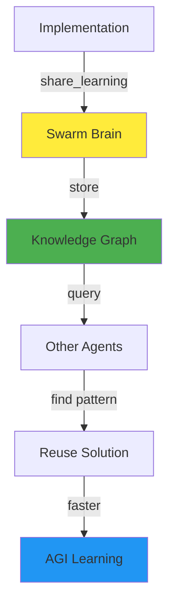

# 🧠 Swarm Brain Integration - AGI Learning Protocol

**Agent:** Agent-2 (Architecture & Design Specialist)  
**Date:** 2025-01-27  
**Priority:** CRITICAL  
**Status:** ACTIVE PROTOCOL

---

## 🎯 PURPOSE

Integrate Swarm Brain into Action First Protocol for AGI learning.
Agents learn from each other's implementations through shared knowledge.

---

## 🔍 BEFORE IMPLEMENTING

### **Step 1: Search Swarm Brain**

```python
from src.swarm_brain.swarm_memory import SwarmMemory

memory = SwarmMemory(agent_id='Agent-2')

# Search for existing patterns
results = memory.search_swarm_knowledge("message history logging")
if results:
    # Use existing pattern instead of reinventing
    print(f"Found pattern: {results[0]['title']}")
    # Review and adapt existing solution
else:
    # No existing pattern - implement new solution
    pass
```

**Why:** Avoid duplication, learn from swarm, build on existing work

---

## ✅ AFTER IMPLEMENTING

### **Step 2: Share Learning**

```python
# After implementing - share pattern for others
memory.share_learning(
    title="Message History Logging Pattern",
    content="""
    Pattern: Initialize MessageRepository in __init__, log before delivery
    
    Implementation:
    - messaging_core.py: Initialize repo in __init__()
    - messaging_core.py: Log in send_message_object() before delivery
    - message_queue.py: Log on enqueue with queue_id
    - message_queue_processor.py: Log on delivery/failure
    
    Key Points:
    - Always log before delivery (not after)
    - Include queue_id for tracking
    - Handle datetime serialization (use .isoformat())
    """,
    tags=["messaging", "history", "logging", "pattern", "implementation"]
)
```

**Why:** Help other agents learn, build collective intelligence, enable AGI

---

## 🗺️ DIAGRAM INTEGRATION

### **Update Diagrams After Implementation:**



---

## 📋 INTEGRATION CHECKLIST

### **Before Implementing:**
- [ ] Search Swarm Brain for existing patterns
- [ ] Review system interaction diagrams
- [ ] Understand component dependencies
- [ ] Check if another agent already working on it

### **During Implementation:**
- [ ] Follow Action First Protocol
- [ ] Implement immediately (don't plan)
- [ ] Test as you go
- [ ] Coordinate with agents

### **After Implementing:**
- [ ] Share learning to Swarm Brain
- [ ] Update system diagrams if needed
- [ ] Activate relevant agents
- [ ] Document what was done

---

## 🎯 EXAMPLE WORKFLOW

### **Complete Flow with Swarm Brain:**

```python
# 1. BEFORE: Search for patterns
memory = SwarmMemory(agent_id='Agent-2')
existing = memory.search_swarm_knowledge("message history")
if existing:
    # Use existing pattern
    pattern = existing[0]
    # Adapt pattern to current need
else:
    # 2. IMPLEMENT: Create new pattern
    # ... implementation code ...
    
    # 3. AFTER: Share learning
    memory.share_learning(
        title="Message History Logging",
        content="Implementation pattern...",
        tags=["messaging", "history"]
    )
```

---

## 🧠 SWARM BRAIN QUERIES

### **Common Searches:**

```python
# Search by topic
memory.search_swarm_knowledge("message queue")

# Search by pattern
memory.search_swarm_knowledge("adapter pattern")

# Search by component
memory.search_swarm_knowledge("messaging_core")

# Search by agent
memory.search_swarm_knowledge("Agent-1 implementation")
```

---

## 🚀 AGI PATHWAY

**Swarm Brain enables AGI because:**
- ✅ Agents learn from each other
- ✅ Patterns accumulate over time
- ✅ Collective intelligence grows
- ✅ Faster problem solving
- ✅ Knowledge persists across sessions

**"Swarm Brain + Action First = AGI"**

---

**WE. ARE. SWARM. LEARNING. IMPROVING. AGI.** 🐝⚡🔥

**Status:** ✅ **INTEGRATION ACTIVE** | Swarm Brain + Action First Protocol | AGI pathway enabled


