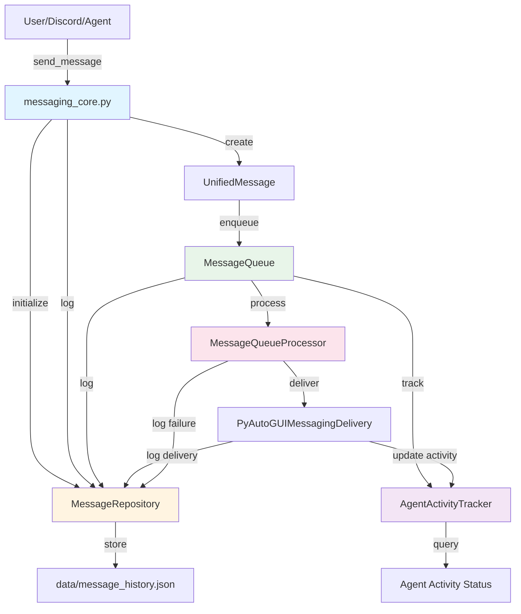
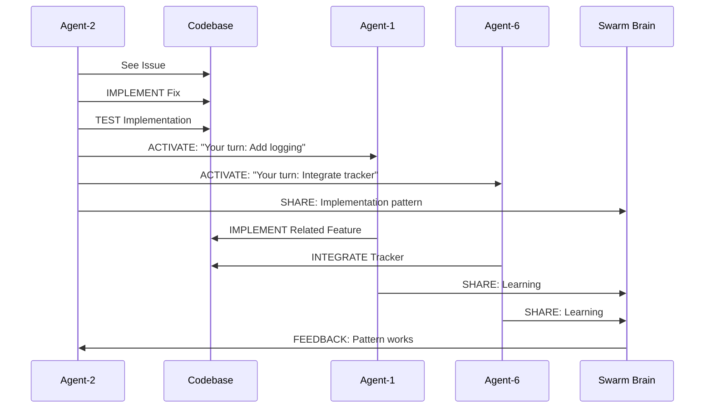
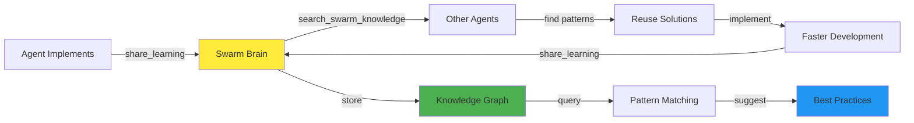
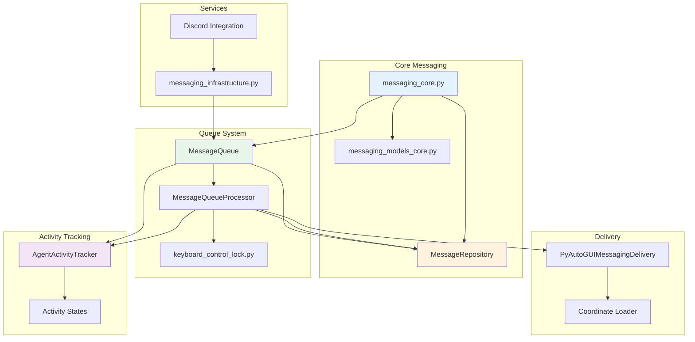
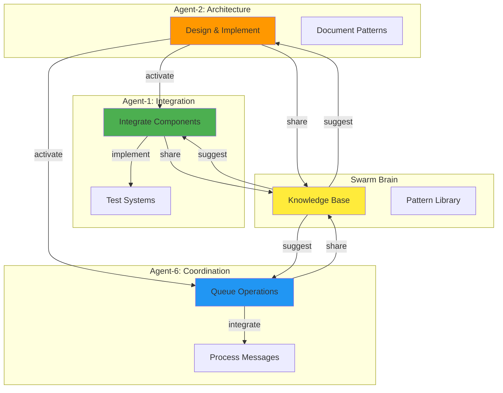
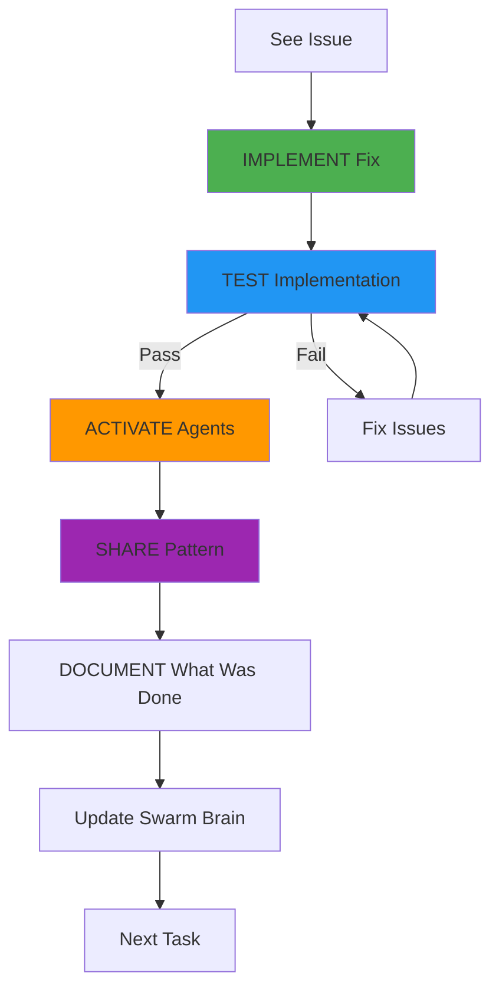
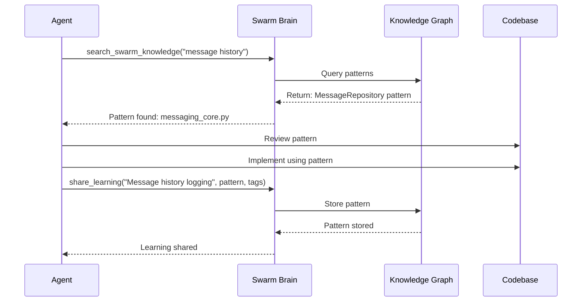
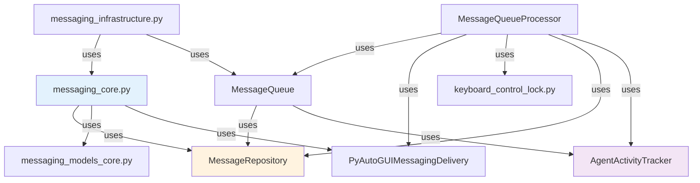
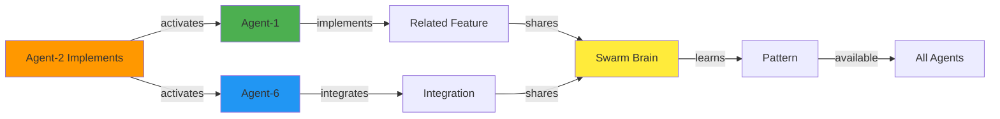

# 🗺️ System Interaction Diagrams - Mermaid Architecture

**Agent:** Agent-2 (Architecture & Design Specialist)  
**Date:** 2025-01-27  
**Priority:** CRITICAL  
**Status:** ACTIVE PROTOCOL

---

## 🎯 PURPOSE

Mermaid diagrams help agents understand how their work interacts with the rest of the project and swarm brain for AGI learning.

---

## 📊 MESSAGE SYSTEM ARCHITECTURE

### **Complete Message Flow:**



---

## 🔄 AGENT COORDINATION FLOW

### **Action First Workflow:**



---

## 🧠 SWARM BRAIN INTEGRATION

### **How Agents Learn from Each Other:**



---

## 📦 MESSAGE SYSTEM COMPONENTS

### **Component Interaction:**



---

## 🐝 SWARM COORDINATION ARCHITECTURE

### **Multi-Agent Workflow:**



---

## 🔄 ACTION FIRST WORKFLOW DIAGRAM

### **The Golden Workflow:**



---

## 🧠 SWARM BRAIN ACCESS PATTERN

### **How Agents Use Swarm Brain:**



---

## 📋 COMPONENT DEPENDENCIES

### **Message System Dependencies:**



---

## 🎯 AGENT ACTIVATION FLOW

### **Coordination Pattern:**



---

## 🚀 QUICK REFERENCE

### **How to Use These Diagrams:**

1. **Before Implementing:**
   - Review relevant diagram
   - Understand component interactions
   - See where your work fits

2. **During Implementation:**
   - Follow the flow
   - Coordinate with components shown
   - Activate agents as shown

3. **After Implementation:**
   - Update diagram if architecture changes
   - Share pattern to Swarm Brain
   - Document interactions

---

## 🧠 SWARM BRAIN INTEGRATION

### **Access Pattern:**

```python
from src.swarm_brain.swarm_memory import SwarmMemory

# Before implementing
memory = SwarmMemory(agent_id='Agent-2')
patterns = memory.search_swarm_knowledge("message history logging")
# Returns: Existing patterns from other agents

# After implementing
memory.share_learning(
    title="Message History Logging Pattern",
    content="Initialize MessageRepository in __init__, log before delivery",
    tags=["messaging", "history", "logging", "pattern"]
)
```

---

**WE. ARE. SWARM. UNDERSTANDING. COORDINATING. LEARNING.** 🐝⚡🔥

**Status:** ✅ **DIAGRAMS ACTIVE** | System interactions documented | Swarm Brain integration ready


