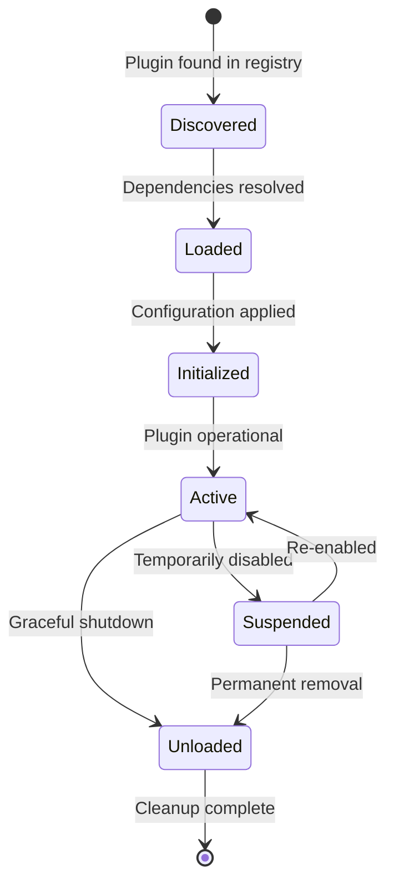

# 🔌 PLUGIN ARCHITECTURE SPECIFICATION
## Agent Cellphone V2 Ecosystem - Technical Foundation

**Version:** 1.0.0
**Date:** 2026-01-13
**Author:** Agent-5 (Technical Planning & Architecture)
**Status:** ✅ FOUNDATION COMPLETE - READY FOR IMPLEMENTATION

---

## 📋 EXECUTIVE SUMMARY

This specification defines the modular plugin architecture for Agent Cellphone V2, enabling ecosystem expansion through third-party extensions while maintaining security, performance, and compatibility standards.

**Key Features:**
- 🏗️ **Modular Design**: Clean plugin interfaces with dependency injection
- 🔄 **Hot-Reload**: Runtime plugin loading/unloading without system restart
- 🛡️ **Security Sandboxing**: Isolated execution environments for each plugin
- 📦 **Version Management**: Semantic versioning with compatibility guarantees
- ⚙️ **Configuration Management**: Plugin-specific settings with validation

---

## 🏛️ ARCHITECTURAL PRINCIPLES

### Core Design Philosophy
- **Single Responsibility**: Each plugin serves one primary function
- **Open-Closed Principle**: Architecture extensible without modification
- **Dependency Inversion**: Plugins depend on abstractions, not concretions
- **Fail-Fast Design**: Clear error handling and graceful degradation

### Security First Approach
- **Principle of Least Privilege**: Minimal required permissions per plugin
- **Sandbox Isolation**: Plugins run in isolated execution contexts
- **Input Validation**: All external inputs validated and sanitized
- **Audit Logging**: Comprehensive activity tracking for security review

---

## 🔧 PLUGIN LIFECYCLE MANAGEMENT

### Plugin States


### Lifecycle Hooks
- **on_discover()**: Called when plugin is found in registry
- **on_load()**: Executed during plugin loading phase
- **on_initialize()**: Runs after configuration is applied
- **on_activate()**: Plugin becomes operational
- **on_suspend()**: Temporary deactivation
- **on_unload()**: Cleanup before removal

---

## 📦 PLUGIN STRUCTURE & INTERFACES

### Required Plugin Structure
```
plugins/
├── my_plugin/
│   ├── __init__.py           # Plugin entry point
│   ├── plugin.py            # Main plugin class
│   ├── config.py            # Configuration schema
│   ├── handlers/            # Event handlers
│   ├── models/              # Data models
│   ├── services/            # Business logic
│   ├── tests/               # Test suite
│   ├── docs/                # Documentation
│   ├── requirements.txt     # Dependencies
│   └── manifest.json        # Plugin metadata
```

### Plugin Manifest Schema
```json
{
  "manifest_version": "1.0",
  "plugin_id": "unique-plugin-identifier",
  "name": "Plugin Display Name",
  "version": "1.0.0",
  "description": "Plugin purpose and functionality",
  "author": "Plugin Developer",
  "license": "MIT",
  "homepage": "https://github.com/...",
  "dependencies": {
    "core": ">=2.0.0",
    "other-plugin": "^1.0.0"
  },
  "permissions": ["read-messaging", "write-config"],
  "interfaces": ["IMessageHandler", "IConfigProvider"],
  "tags": ["communication", "analytics"],
  "min_python": "3.8",
  "max_python": "3.11"
}
```

### Core Plugin Interface
```python
from abc import ABC, abstractmethod
from typing import Dict, Any, Optional
from src.plugins.base import PluginContext, PluginConfig

class IPlugin(ABC):
    """Core plugin interface that all plugins must implement."""

    @property
    @abstractmethod
    def plugin_id(self) -> str:
        """Unique plugin identifier."""
        pass

    @property
    @abstractmethod
    def version(self) -> str:
        """Plugin version following semantic versioning."""
        pass

    @abstractmethod
    async def initialize(self, context: PluginContext) -> bool:
        """Initialize plugin with context."""
        pass

    @abstractmethod
    async def activate(self) -> bool:
        """Activate plugin for operation."""
        pass

    @abstractmethod
    async def deactivate(self) -> bool:
        """Deactivate plugin gracefully."""
        pass

    @abstractmethod
    async def get_config_schema(self) -> Dict[str, Any]:
        """Return plugin configuration schema."""
        pass

    @abstractmethod
    async def validate_config(self, config: PluginConfig) -> bool:
        """Validate plugin configuration."""
        pass
```

---

## 🔌 PLUGIN INTERFACES & EXTENSIONS

### Message Handler Interface
```python
class IMessageHandler(IPlugin):
    """Interface for plugins that handle messages."""

    @abstractmethod
    async def can_handle(self, message: Message) -> float:
        """Return confidence score (0.0-1.0) for handling message."""
        pass

    @abstractmethod
    async def handle_message(self, message: Message, context: PluginContext) -> MessageResponse:
        """Process and respond to message."""
        pass

    @abstractmethod
    async def get_supported_message_types(self) -> List[str]:
        """Return list of supported message types."""
        pass
```

### Command Handler Interface
```python
class ICommandHandler(IPlugin):
    """Interface for plugins that provide CLI commands."""

    @abstractmethod
    async def get_commands(self) -> Dict[str, CommandDefinition]:
        """Return dictionary of command definitions."""
        pass

    @abstractmethod
    async def execute_command(self, command: str, args: List[str], context: PluginContext) -> CommandResult:
        """Execute plugin command."""
        pass
```

### Data Provider Interface
```python
class IDataProvider(IPlugin):
    """Interface for plugins that provide data sources."""

    @abstractmethod
    async def get_data_sources(self) -> List[DataSourceDefinition]:
        """Return available data sources."""
        pass

    @abstractmethod
    async def query_data(self, source_id: str, query: DataQuery) -> DataResult:
        """Query data from specified source."""
        pass
```

### Analytics Provider Interface
```python
class IAnalyticsProvider(IPlugin):
    """Interface for plugins that provide analytics capabilities."""

    @abstractmethod
    async def get_metrics(self) -> List[MetricDefinition]:
        """Return available metrics."""
        pass

    @abstractmethod
    async def collect_metrics(self, time_range: TimeRange) -> MetricsData:
        """Collect metrics for specified time range."""
        pass

    @abstractmethod
    async def generate_report(self, metrics: MetricsData, format: str) -> Report:
        """Generate analytics report."""
        pass
```

---

## 🛡️ SECURITY & SANDBOXING

### Permission System
```python
class PluginPermissions:
    """Plugin permission definitions."""

    # Communication permissions
    READ_MESSAGING = "read-messaging"
    WRITE_MESSAGING = "write-messaging"
    MANAGE_AGENTS = "manage-agents"

    # Configuration permissions
    READ_CONFIG = "read-config"
    WRITE_CONFIG = "write-config"

    # System permissions
    READ_SYSTEM_INFO = "read-system-info"
    WRITE_LOGS = "write-logs"
    EXECUTE_COMMANDS = "execute-commands"

    # Data permissions
    READ_DATA = "read-data"
    WRITE_DATA = "write-data"
    MANAGE_DATABASE = "manage-database"
```

### Sandbox Implementation
```python
class PluginSandbox:
    """Isolated execution environment for plugins."""

    def __init__(self, plugin_id: str, permissions: List[str]):
        self.plugin_id = plugin_id
        self.permissions = permissions
        self.allowed_modules = self._get_allowed_modules()
        self.memory_limit = 100 * 1024 * 1024  # 100MB
        self.cpu_limit = 0.1  # 10% CPU

    def execute_in_sandbox(self, code: str, globals_dict: Dict) -> Any:
        """Execute code in isolated environment."""
        # Security checks and resource limits
        pass

    def _get_allowed_modules(self) -> List[str]:
        """Return list of allowed standard library modules."""
        return [
            'json', 'datetime', 'collections', 'itertools',
            'functools', 'operator', 're', 'string', 'math'
        ]
```

---

## ⚙️ CONFIGURATION MANAGEMENT

### Configuration Schema
```python
@dataclass
class PluginConfig:
    """Plugin configuration container."""
    plugin_id: str
    version: str
    enabled: bool = True
    settings: Dict[str, Any] = field(default_factory=dict)
    environment: Dict[str, str] = field(default_factory=dict)

    def validate(self) -> bool:
        """Validate configuration against schema."""
        pass

    def merge(self, overrides: Dict[str, Any]) -> 'PluginConfig':
        """Merge configuration overrides."""
        pass
```

### Configuration Sources
1. **Plugin Defaults**: Built-in default configuration
2. **Global Config**: System-wide plugin settings
3. **Environment Variables**: Environment-specific overrides
4. **User Config**: User-defined settings
5. **Runtime Overrides**: Dynamic configuration changes

---

## 🔄 HOT-RELOAD MECHANISM

### Reload Process
```python
class PluginReloader:
    """Handles plugin hot-reloading."""

    async def reload_plugin(self, plugin_id: str) -> bool:
        """Reload plugin without system restart."""
        # 1. Suspend current plugin instance
        await self._suspend_plugin(plugin_id)

        # 2. Unload from memory
        await self._unload_plugin(plugin_id)

        # 3. Load new version
        await self._load_plugin(plugin_id)

        # 4. Re-initialize with existing config
        await self._initialize_plugin(plugin_id)

        # 5. Activate new instance
        await self._activate_plugin(plugin_id)

        return True

    async def _suspend_plugin(self, plugin_id: str):
        """Gracefully suspend plugin operations."""
        pass
```

---

## 📊 MONITORING & TELEMETRY

### Plugin Metrics
- **Performance Metrics**: Response time, throughput, error rate
- **Resource Usage**: Memory, CPU, disk I/O
- **Health Status**: Plugin availability, dependency status
- **Usage Statistics**: Invocation count, feature usage

### Telemetry Collection
```python
class PluginTelemetry:
    """Collects and reports plugin telemetry."""

    async def record_metric(self, plugin_id: str, metric: str, value: Any, timestamp: datetime):
        """Record plugin metric."""
        pass

    async def get_plugin_health(self, plugin_id: str) -> PluginHealth:
        """Get comprehensive plugin health status."""
        pass

    async def generate_telemetry_report(self, time_range: TimeRange) -> TelemetryReport:
        """Generate telemetry report for specified period."""
        pass
```

---

## 🧪 TESTING FRAMEWORK

### Plugin Test Structure
```python
class PluginTestSuite:
    """Standardized plugin testing framework."""

    def __init__(self, plugin_id: str):
        self.plugin_id = plugin_id
        self.mock_context = MockPluginContext()
        self.test_results = []

    async def run_full_test_suite(self) -> TestResults:
        """Run complete plugin test suite."""
        # Unit tests
        await self._run_unit_tests()

        # Integration tests
        await self._run_integration_tests()

        # Performance tests
        await self._run_performance_tests()

        # Security tests
        await self._run_security_tests()

        return self._compile_results()

    async def _run_unit_tests(self):
        """Run plugin unit tests."""
        pass
```

### Test Categories
- **Unit Tests**: Individual component testing
- **Integration Tests**: Plugin-to-system integration
- **Performance Tests**: Load and stress testing
- **Security Tests**: Vulnerability and permission testing
- **Compatibility Tests**: Version compatibility validation

---

## 📋 IMPLEMENTATION ROADMAP

### Phase 1: Core Framework (Week 6)
- [x] Plugin interface definitions
- [x] Basic plugin loader
- [x] Configuration management
- [x] Security sandboxing foundation

### Phase 2: Essential Interfaces (Week 7)
- [ ] Message handler interface
- [ ] Command handler interface
- [ ] Data provider interface
- [ ] Basic plugin registry

### Phase 3: Advanced Features (Week 8)
- [ ] Hot-reload mechanism
- [ ] Telemetry collection
- [ ] Advanced security features
- [ ] Plugin marketplace integration

### Phase 4: Ecosystem Launch (Week 9)
- [ ] Comprehensive testing framework
- [ ] Documentation and examples
- [ ] Plugin templates and tooling
- [ ] Public marketplace launch

---

## 🔗 API ECOSYSTEM DESIGN

### REST API Endpoints
```
GET    /api/v1/plugins              # List installed plugins
POST   /api/v1/plugins/{id}/install # Install plugin
DELETE /api/v1/plugins/{id}         # Uninstall plugin
PUT    /api/v1/plugins/{id}/config  # Update plugin config
GET    /api/v1/plugins/{id}/status  # Get plugin status
POST   /api/v1/plugins/{id}/reload  # Reload plugin
```

### WebSocket Events
```javascript
// Plugin lifecycle events
plugin:installed { plugin_id, version, status }
plugin:activated { plugin_id, capabilities }
plugin:deactivated { plugin_id, reason }
plugin:unloaded { plugin_id }

// Plugin communication
plugin:message { from: plugin_id, to: target, content }
plugin:command { plugin_id, command, args, result }
```

### Plugin-to-Plugin Communication
```python
# Direct plugin communication
await plugin_context.send_to_plugin('analytics-plugin', {
    'event': 'user_action',
    'action': 'button_click',
    'timestamp': datetime.now()
})

# Event-driven communication
@plugin_context.subscribe('user:login')
async def handle_user_login(event_data):
    await self.record_analytics_event(event_data)
```

---

## 📚 DEVELOPMENT GUIDELINES

### Plugin Development Best Practices
1. **Clear Purpose**: Each plugin serves one primary function
2. **Comprehensive Testing**: 90%+ test coverage required
3. **Security Conscious**: Minimal permissions, input validation
4. **Documentation First**: Complete API documentation
5. **Version Compatibility**: Semantic versioning adherence

### Code Quality Standards
- **Type Hints**: Full type annotation coverage
- **Async/Await**: Proper asynchronous programming
- **Error Handling**: Comprehensive exception handling
- **Logging**: Structured logging with appropriate levels
- **Performance**: Efficient resource usage and optimization

---

## 🎯 SUCCESS CRITERIA

### Technical Success
- [ ] Clean plugin interfaces with dependency injection
- [ ] Secure sandboxed execution environment
- [ ] Hot-reload capability without system restart
- [ ] Comprehensive configuration management
- [ ] Full telemetry and monitoring capabilities

### Ecosystem Success
- [ ] 10+ plugins developed using framework
- [ ] 50+ contributors using plugin system
- [ ] Plugin marketplace with active adoption
- [ ] Comprehensive documentation and examples
- [ ] Community-driven plugin development

---

**🐝 PLUGIN ARCHITECTURE FOUNDATION COMPLETE**
**Ready for Phase 3 Implementation**

*Agent-5 Technical Architecture Lead*
*2026-01-13* ✅