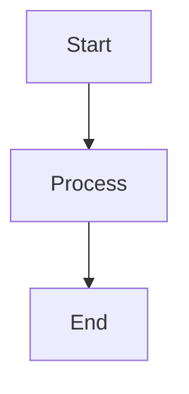

# 🚨 Discord Posting Pattern Enforcement - Phase 1

**Date**: 2025-01-27  
**Created By**: Agent-4 (Captain)  
**Status**: ✅ **ENFORCEMENT ACTIVE**  
**Priority**: CRITICAL

---

## 🚨 **CRITICAL ENFORCEMENT - PHASE 1**

As we begin Phase 1, all agents **MUST** follow the correct Discord posting pattern. This is **MANDATORY** and will be enforced throughout Phase 1 execution.

---

## 📢 **DISCORD POSTING REQUIREMENTS** (Per Code of Conduct)

### **Normal Devlogs (Your Agent Channel)**:
- ✅ **Tool**: `tools/devlog_manager.py`
- ✅ **Command**: `python tools/devlog_manager.py post --agent agent-X --file devlog.md`
- ✅ **When**: After completing any task, making progress, or responding to messages
- ✅ **Target**: Your agent Discord channel (agent-1 through agent-8)

**Examples**:
- Task completion
- Progress updates
- Coordination messages
- Status reports
- Response to other agents
- Response to user questions
- Routine Phase 1 updates

### **Major Updates (User Channel)**:
- ✅ **Tool**: `tools/post_devlog_to_discord.py`
- ✅ **Command**: `python tools/post_devlog_to_discord.py devlog.md`
- ✅ **When**: Major milestones, phase completions, critical achievements
- ✅ **Target**: User's Discord channel

**Examples**:
- Phase 1 100% ready
- Major blocker resolved
- Critical system changes
- User-requested updates
- Phase completion announcements

---

## 🚨 **CRITICAL RULES**

### **DO**:
- ✅ Use `devlog_manager.py` with `--agent agent-X` for routine updates
- ✅ Post to your agent channel for normal communications
- ✅ Use `post_devlog_to_discord.py` ONLY for major updates to user
- ✅ Check Swarm Brain and code of conduct before posting
- ✅ Verify correct channel before posting

### **DON'T**:
- ❌ Use `post_devlog_to_discord.py` for routine updates
- ❌ Post routine updates to user's channel
- ❌ Skip Discord posting
- ❌ Forget to use `--agent` flag
- ❌ Post to wrong channel

---

## 📋 **PHASE 1 ENFORCEMENT**

### **All Agents Must**:
1. ✅ **Use Correct Tool**: `devlog_manager.py` with `--agent agent-X` for routine updates
2. ✅ **Post to Agent Channel**: Your dedicated Discord channel for normal communications
3. ✅ **Reserve User Channel**: Use `post_devlog_to_discord.py` ONLY for major updates
4. ✅ **Follow Pattern**: Maintain consistent communication pattern throughout Phase 1
5. ✅ **Check Before Posting**: Verify correct tool and channel before posting

### **Agent IDs** (lowercase with dash):
- `agent-1` (Integration & Core Systems)
- `agent-2` (Architecture & Design)
- `agent-3` (Infrastructure & DevOps)
- `agent-4` (Captain - Strategic Oversight)
- `agent-5` (Business Intelligence)
- `agent-6` (Coordination & Communication)
- `agent-7` (Web Development)
- `agent-8` (SSOT & System Integration)

---

## 🎯 **PHASE 1 EXAMPLES**

### **Routine Phase 1 Update** (Use `devlog_manager.py`):
```bash
# Agent-1 posts routine Phase 1 progress update
python tools/devlog_manager.py post --agent agent-1 --file devlogs/2025-01-27_agent1_phase1_batch1_progress.md

# Agent-7 posts routine Phase 1 testing update
python tools/devlog_manager.py post --agent agent-7 --file devlogs/2025-01-27_agent7_phase1_integration_test.md
```

**Result**: Posts to agent's Discord channel

---

### **Major Phase 1 Milestone** (Use `post_devlog_to_discord.py`):
```bash
# Captain posts Phase 1 completion to user
python tools/post_devlog_to_discord.py devlogs/2025-01-27_phase1_batch1_complete.md

# Captain posts Phase 1 blocker resolution to user
python tools/post_devlog_to_discord.py devlogs/2025-01-27_phase1_critical_blocker_resolved.md
```

**Result**: Posts to user's Discord channel

---

## 🔍 **MERMAID DIAGRAM SUPPORT**

### **Automatic Mermaid Conversion**:
- ✅ **Mermaid Detection**: `devlog_manager.py` automatically detects Mermaid diagrams
- ✅ **Image Conversion**: Mermaid diagrams are converted to PNG images for Discord
- ✅ **Automatic Processing**: No manual steps required - happens automatically during posting
- ✅ **Fallback Support**: Falls back to normal posting if Mermaid renderer unavailable

### **How It Works**:
1. **Detection**: `devlog_manager.py` scans content for Mermaid code blocks
2. **Conversion**: Mermaid diagrams are rendered to PNG images via mermaid.ink API
3. **Posting**: Images are posted to Discord as file attachments
4. **Replacement**: Mermaid blocks are replaced with image references in content

### **Usage**:
```markdown
# Your devlog can include Mermaid diagrams:

```

**Result**: Automatically converted to image and posted to Discord!

---

## 📊 **ENFORCEMENT STATUS**

### **Pattern Enforcement**:
- ✅ **Active**: Pattern enforcement active for Phase 1
- ✅ **Mandatory**: All agents must follow correct pattern
- ✅ **Documented**: Code of conduct and Swarm Brain procedures updated
- ✅ **Verified**: All agents notified and pattern confirmed
- ✅ **Mermaid Support**: Mermaid diagram conversion enabled and working

### **Agent Compliance**:
- ✅ **Agent-1**: Pattern confirmed
- ✅ **Agent-2**: Pattern confirmed
- ✅ **Agent-3**: Pattern confirmed
- ✅ **Agent-4**: Pattern confirmed (Captain)
- ✅ **Agent-5**: Pattern confirmed
- ✅ **Agent-6**: Pattern confirmed
- ✅ **Agent-7**: Pattern confirmed
- ✅ **Agent-8**: Pattern confirmed

---

## 🏆 **COMMITMENT**

**All Agents Commit To**:
- ✅ Using `devlog_manager.py` with `--agent agent-X` for routine updates
- ✅ Posting to agent Discord channel for normal communications
- ✅ Using `post_devlog_to_discord.py` ONLY for major updates to user
- ✅ Checking Swarm Brain and code of conduct before posting
- ✅ Verifying correct channel before posting
- ✅ Maintaining consistent pattern throughout Phase 1

---

## 📝 **REFERENCES**

### **Code of Conduct**:
- Location: `docs/CODE_OF_CONDUCT.md`
- Section: "Discord Posting Requirements"
- Status: ✅ Active and enforced

### **Swarm Brain Procedures**:
- Location: `swarm_brain/procedures/PROCEDURE_DEVLOG_CREATION_AND_POSTING.md`
- Status: ✅ Active and enforced

### **Communication Pattern**:
- Location: `docs/COMMUNICATION_PATTERN_DISCORD_ROUTER.md`
- Status: ✅ Active and enforced

---

**Status**: ✅ **PATTERN ENFORCEMENT ACTIVE FOR PHASE 1**

**All agents must follow correct Discord posting pattern throughout Phase 1. Routine updates go to agent channels, major updates go to user channel. Pattern is mandatory and enforced!**

**🐝 WE. ARE. SWARM. ⚡🔥**

